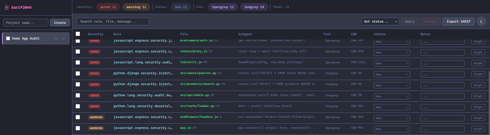
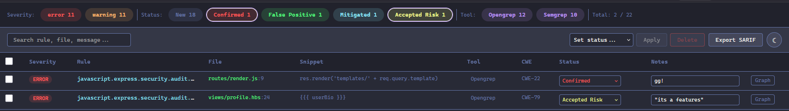
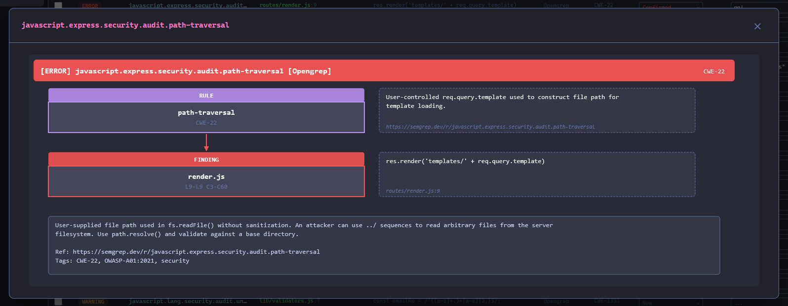
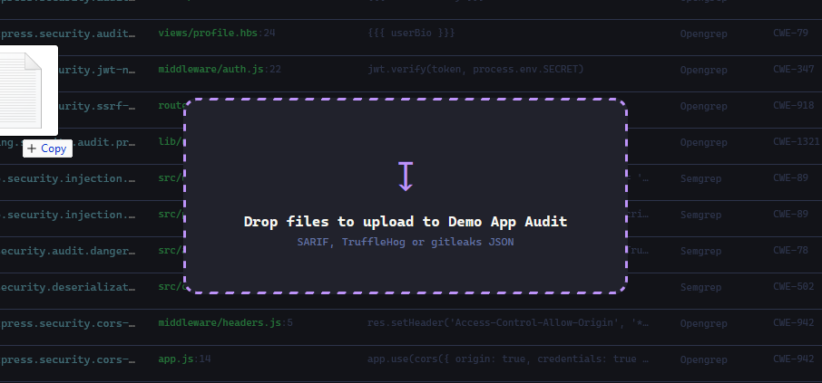

# Sarif2Web

> Built with [Claude Code](https://claude.ai/code)

Web app to manage and review security findings from [SARIF](https://sarifweb.azurewebsites.net/) and JSON files. Upload scan results, triage, filter, visualize code flows and export.

**This is a local tool, not a production service.** It's meant to run on your machine via Docker Compose during an audit or triage session. There is no authentication, no user management, no HTTPS.

## Supported Tools

| Tool               | Status | Command                                                                       |
|------------------  |--------|-------------------------------------------------------------------------------|
| Semgrep / Opengrep | Tested | `semgrep scan --sarif --sarif-output=scan.sarif`                              |
| CodeQL             | Tested | `codeql database analyze codeql-db --format=sarif-latest --output=scan.sarif` |
| Snyk               | Tested | `snyk test --sarif-file-output=scan.sarif`                                    |
| Gitleaks           | Tested | `gitleaks detect --source=. --report-format=sarif --report-path=scan.sarif`   |
| TruffleHog         | Tested | `trufflehog git https://github.com/repo.git --json > results.jsonl`           |

Any tool that outputs valid SARIF should work.

## Screenshots

Dashboard


Filters & triage


Graph view


Drag & drop upload


## Features

- **Drag & drop upload** : drop `.sarif` or `.json` files anywhere on the page, auto-creates a project if none is selected
- **Multi-format** : SARIF, gitleaks JSON, TruffleHog JSONL
- **Multi-file projects** : merge multiple scans into one project with automatic dedup
- **Integrated scanning** : launch scans from the UI with a Git repo URL (see [Integrated Scanners](#integrated-scanners))
- **Settings & tokens** : configure API tokens (Semgrep, Snyk, GitHub) via the gear icon, stored in MongoDB
- **Filter bar** : filter by severity, status, tool from the stats bar or table cells
- **Search** : full-text across rule IDs, file paths, messages, snippets
- **Status tracking** : triage as New, Confirmed, False Positive, Mitigated, Accepted Risk
- **Bulk operations** : select multiple findings to update status or delete
- **Soft delete + undo** : deleted findings can be restored via the undo toast (6s)
- **Notes** : annotate findings
- **SVG code flow graphs** : visualize source-to-sink data flows
- **SARIF export** : re-export with review metadata (status + notes)
- **Dark / Light theme** : Dracula dark and clean light, persisted in local storage

## Quick Start

```bash
docker compose build --no-cache
docker compose up
```

App available at **http://localhost:9090**

```bash
docker compose down        # stop services
docker compose down -v     # stop + wipe database
```

## Architecture

```
Browser --> Nginx (:9090) --> Flask/Gunicorn (:5000) --> MongoDB (:27017)
```

| Service   | Role                                            |
|-----------|-------------------------------------------------|
| Nginx     | Reverse proxy, 50 MB upload limit, 120s timeout |
| Flask     | Python 3.12 app server, 2 Gunicorn workers      |
| MongoDB 7 | Document store, persistent Docker volume        |

## Project Structure

```
sarif2web/
├── app/
│   ├── app.py              # Flask entry point, registers blueprints
│   ├── db.py               # MongoDB connection, collections, indexes
│   ├── parsers.py          # Format detection + SARIF/TruffleHog/gitleaks parsers
│   ├── helpers.py          # Serialization, dedup hash, finding insertion
│   ├── scanner.py          # Scanner definitions, background scan execution
│   ├── svg.py              # SVG code flow renderer
│   ├── routes/
│   │   ├── __init__.py     # Blueprint registration
│   │   ├── projects.py     # Project CRUD
│   │   ├── findings.py     # Findings CRUD, bulk ops, SVG endpoint
│   │   ├── scans.py        # Scan creation, listing, deletion
│   │   ├── settings.py     # Token settings
│   │   └── upload.py       # File upload + SARIF export
│   ├── requirements.txt
│   └── templates/
│       └── index.html      # Frontend SPA (vanilla JS, no build step)
├── nginx/
│   └── nginx.conf
├── Dockerfile
└── docker-compose.yml
```

## Integrated Scanners

The app can clone a Git repo and run scanners directly from the UI. Click **Scan**, provide a repo URL, pick a scanner.

| Scanner    | Token required | Behavior                                                                                     |
|------------|----------------|----------------------------------------------------------------------------------------------|
| Semgrep    | Optional       | Without token: `semgrep scan` with default rules. With token: `semgrep ci` with Cloud rules. |
| Snyk       | **Required**   | Needs a Snyk API token. Scans are blocked if no token is configured.                         |
| CodeQL     | No             | Auto-detects language, creates a CodeQL database, runs analysis.                             |
| TruffleHog | No             | Scans the filesystem for leaked secrets.                                                     |
| Gitleaks   | No             | Fast regex + entropy-based secret detection.                                                 |

### Settings & API Tokens

Click the gear icon in the toolbar to open Settings. Tokens are stored in MongoDB and persist across restarts.

| Token         | Purpose                                                             |
|---------------|---------------------------------------------------------------------|
| Semgrep Token | Enables `semgrep ci` with Semgrep Cloud Platform rules and policies |
| Snyk Token    | Required for Snyk CLI auth (`snyk code test`)                       |
| GitHub Token  | Allows cloning private repos via HTTPS                              |

- Tokens are displayed masked (e.g. `••••abcd`) when set
- Use the **X** button next to a token field to remove it
- If a scan requires a missing token, you get an error pointing to Settings

## Configuration

| Variable    | Default                               | Description               |
|-------------|---------------------------------------|---------------------------|
| `MONGO_URI` | `mongodb://mongo:27017/sarif_manager` | MongoDB connection string |

## API Reference

| Method   | Endpoint                    | Description                                        |
|----------|-----------------------------|----------------------------------------------------|
| `POST`   | `/api/projects`             | Create a project                                   |
| `GET`    | `/api/projects`             | List projects                                      |
| `DELETE` | `/api/projects/<id>`        | Delete a project + findings                        |
| `POST`   | `/api/projects/bulk-delete` | Bulk delete projects                               |
| `POST`   | `/api/upload`               | Upload file (multipart: `file` + `project_id`)     |
| `GET`    | `/api/findings`             | List findings (`project_id`, `status`, `level`, `tool`, `q`) |
| `GET`    | `/api/findings/counts`      | Counts by level, status, tool                      |
| `PATCH`  | `/api/findings/<id>`        | Update status or notes                             |
| `PATCH`  | `/api/findings/bulk`        | Bulk update statuses                               |
| `POST`   | `/api/findings/bulk-delete` | Soft-delete findings                               |
| `POST`   | `/api/findings/restore`     | Restore soft-deleted findings                      |
| `GET`    | `/api/findings/<id>/svg`    | SVG code flow visualization                        |
| `GET`    | `/api/export/<project_id>`  | Export as SARIF                                    |
| `GET`    | `/api/scanners`             | List available scanners                            |
| `POST`   | `/api/scans`                | Launch a scan (repo URL + scanner)                 |
| `GET`    | `/api/scans`                | List scans for a project                           |
| `GET`    | `/api/scans/<id>`           | Get scan status and details                        |
| `DELETE` | `/api/scans/<id>`           | Delete a scan record                               |
| `GET`    | `/api/settings`             | Get settings (tokens masked)                       |
| `PUT`    | `/api/settings`             | Update settings (tokens)                           |

### Examples

```bash
# Create a project
curl -X POST http://localhost:9090/api/projects \
  -H "Content-Type: application/json" \
  -d '{"name": "my-audit"}'

# Upload a SARIF file
curl -X POST http://localhost:9090/api/upload \
  -F "file=@results.sarif" \
  -F "project_id=<project_id>"

# List findings with filters
curl "http://localhost:9090/api/findings?project_id=<id>&level=error&status=new&tool=Semgrep"

# Bulk update statuses
curl -X PATCH http://localhost:9090/api/findings/bulk \
  -H "Content-Type: application/json" \
  -d '{"ids": ["id1", "id2"], "status": "false_positive"}'

# Soft-delete + restore
curl -X POST http://localhost:9090/api/findings/bulk-delete \
  -H "Content-Type: application/json" \
  -d '{"ids": ["id1", "id2"]}'

curl -X POST http://localhost:9090/api/findings/restore \
  -H "Content-Type: application/json" \
  -d '{"ids": ["id1", "id2"]}'

# Export
curl http://localhost:9090/api/export/<project_id> -o export.sarif
```
